进入大二下学期，电脑软件喜加一。无论是四节连上、教室未知的课程安排，还是微信群里一遍又一遍的@所有人，都暗示着我们将要和某款软件度过新学期的美好时光……

它就是：**Xilinx Vivado**，简称 **“喂娃兜”**，主要用于HDL（Hardware Description Language，硬件描述语言）的设计、综合与分析。此软件以其**安装复杂**、**启动缓慢**、**不支持中文**以及**玄学报错**等特性广受学生好评，自带编辑器更是以朴实、简约著称，几乎没有任何辅助功能，时刻让人体会着最原始的编程意境。

懒是人类进步的动力。我们总希望敲代码的过程能更简单些，好让我们专注于知识的学习——我们开始吧。

<!-- more -->

## 一点点快乐

### 安装Visual Studio Code

Visual Studio Code（下面简称VS Code）是一个由微软开发的开源代码编辑器，支持多个平台。它支持测试，并内置了Git版本控制功能，同时也具有开发环境功能，例如代码补全、代码片段和代码重构等。安装过程十分简单，[官网](https://code.visualstudio.com/)下载并按照提示安装即可。

安装完成后，软件界面默认为英文，可以选择安装并使用中文插件。

1. 搜索下载简体中文插件

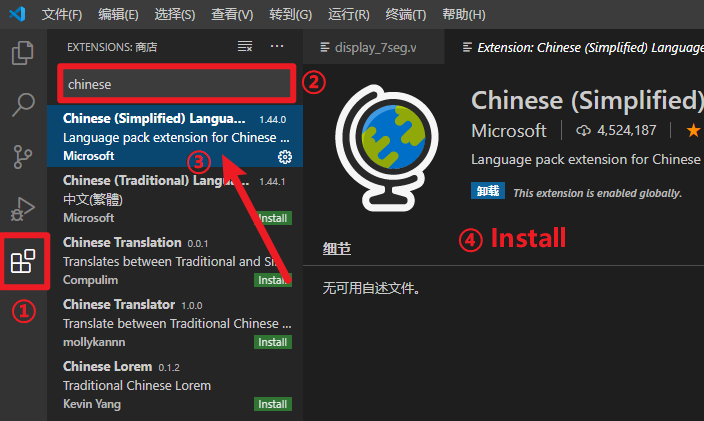

2. 切换语言

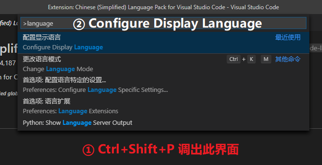

3. 按照操作重新启动程序，即可设置为中文界面。

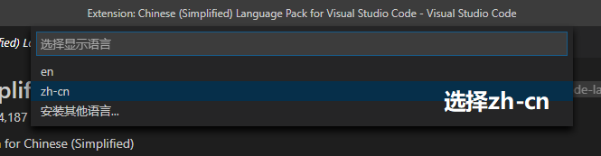

此外，还可以通过设置改变编辑器字体大小（设置 - 文本编辑器 - 字体）以及软件窗口主题色（设置 - 工作台 - 外观）。

### 下载插件获得快乐

和安装简体中文插件的步骤差不多，找一个最热门的下载安装。

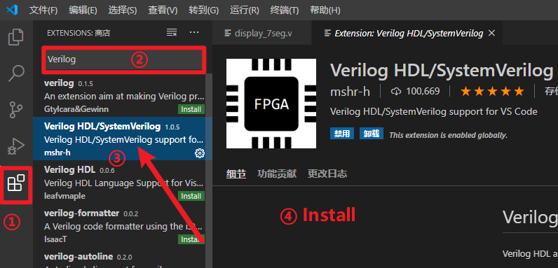

至此，在使用VS Code编辑.v文件时就可以体会**自动补全语句**的快乐了！只要选择语言模式为Verilog即可。

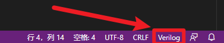

放个动图大家感受一下：

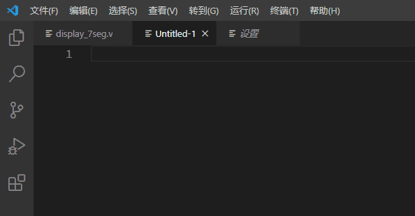

如果只是想敲代码自动补全的话，看到这里其实就可以了。如果各科作业都写完了，可以再往下看看。

## 更多快乐

### 更改Vivado默认编辑器

打开设置（Tools - Settings...），将Text Editor中的Current Editor改为Custom Editor...，在弹出的窗口中输入：

```Command Line
C:/Program Files/Microsoft VS Code/Code.exe -g [file name]:[line number]
```

其中，前面的那一串字符表示你电脑上VS Code的安装位置，请根据个人实际情况自行修改。

这样一波操作之后，在Vivado中打开.v文件将自动跳转至VS Code中进行操作。

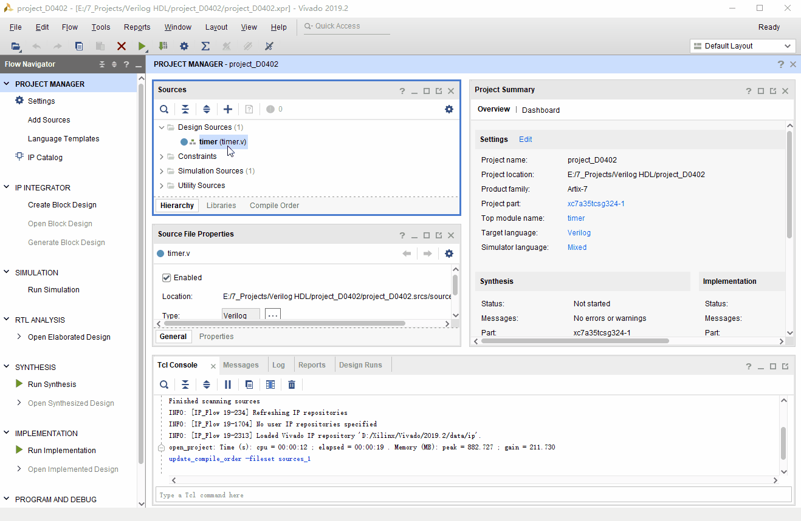

### 安装Ctags实现高级功能

本文1.2中提到的插件，除自动补全一些代码外，还具有Document Symbols Outline、Go to Definition等一些看不懂的便捷功能，而这些功能需要Ctags支持。笔者虽然不知道Ctags是啥、有什么用，但经过摸索，已经熟练掌握了其安装与卸载。

1. [点击此处](https://github.com/universal-ctags/ctags-win32/releases)挑一个看得顺眼的版本下载：

   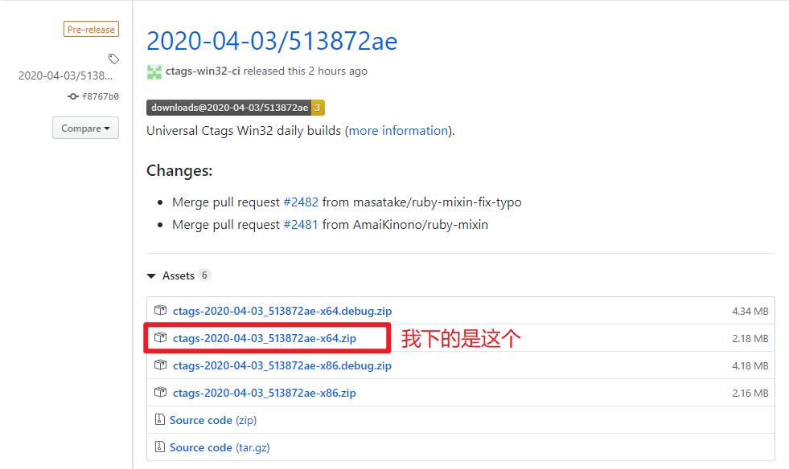

2. 将压缩包解压至电脑的某个角落：

   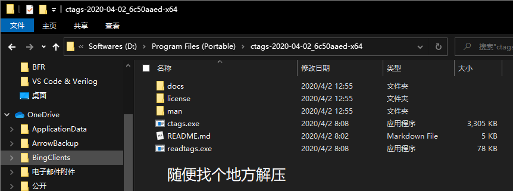
   
3. 编辑系统变量：

   这一步操作在安装各种软件、环境时十分常见。在Windows搜索框中输入Path，找到并打开“编辑系统环境变量”，在弹出的窗口中点击“环境变量(<u>N</u>)...”，在系统变量中找到“Path”，将上一步解压的文件夹路径添加到Path中。

   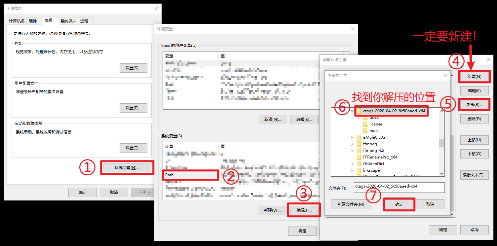

4. 检验安装结果：Win+R调出运行窗口，输入cmd打开命令提示符，输入：

   ```
   ctags --version
   ```

   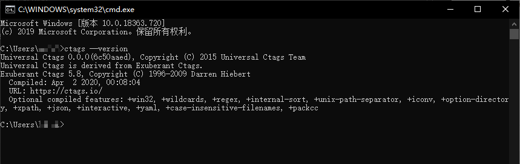

   如果没有报错，那就大功告成了。不出意外的话，VS Code的界面会变成这样：

   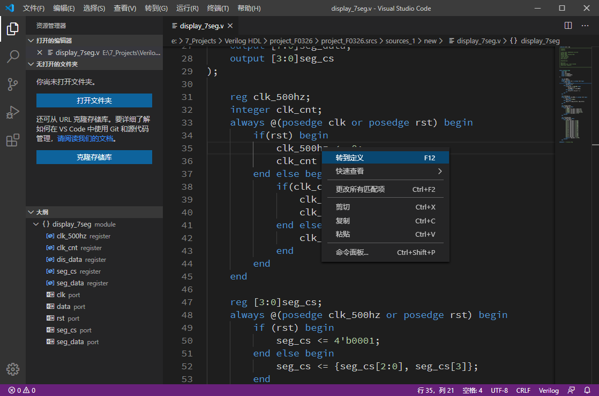

   左下角的大纲虽然似乎没太大用处，不过看起来很高级。转到定义似乎也很方便。

   PS：完成以上操作后建议重启一下系统。

### 使用Icarus Verilog检查语法错误

本文1.2中提到的插件还支持检查语法错误（linting），此功能可以基于xvlog、iverilog、verilator或者modelsim。其中，xvlog是Vivado自带的，不过在笔者的电脑上似乎并不好用。因此，这里简要介绍一下Icarus Verilog（iVerilog）。

[戳此链接](http://bleyer.org/icarus/)下载安装包，按照提示安装。安装过程中有一个复选框“Add executable folder(s) to the user PATH”，要勾选上（如果不勾选就需要手动修改PATH，这样比较麻烦）。

安装后，在命令提示符中输入iverilog，出现以下结果说明安装成功：

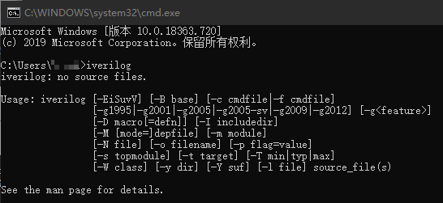

最后，在VS Code设置中将“Verilog > Linting: Linter”设置为“iverilog”。

这样，在写代码时，每次Ctrl+S保存之后都会自动检查语法错误。

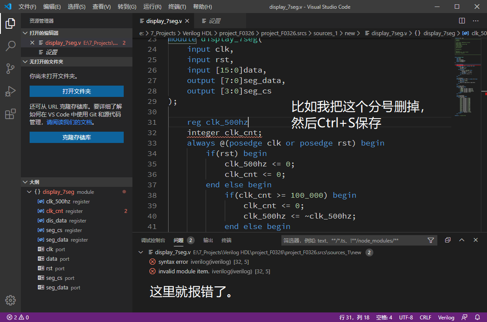

-----

以上就是本文的全部内容了。如果VS Code出现了什么问题，百度或Google可能会有你想要的答案，或者直接去GitHub上反馈Issue。如果实在解决不了，那就换回朴实的Vivado吧。在VS Code里敲完代码再复制粘贴回Vivado也挺好的。

## 参考文献

[1] [南工小王子. Vivado加上VsCode让你的生活更美好.](https://blog.csdn.net/qq_39498701/article/details/84668833)

[2] [Michael ee. Visual Stduio Code for Verilog Coding.](https://www.youtube.com/watch?v=FZ-CQ_TT_hs)

[3] [Visual Studio Code Docs. The Visual Studio Code command-line options.](https://code.visualstudio.com/docs/editor/command-line#_core-cli-options)

[4] [Xilinx Vivado - Wikipedia.](https://en.wikipedia.org/wiki/Xilinx_Vivado)

[5] [mshr-h. Verilog HDL/SystemVerilog support for VS Code.](https://github.com/mshr-h/vscode-verilog-hdl-support)

[6] [TERRA. VSCode加iverilog环境.](https://oopsdump.com/blog/2020/01/vscode%E5%8A%A0iverilog%E7%8E%AF%E5%A2%83/)